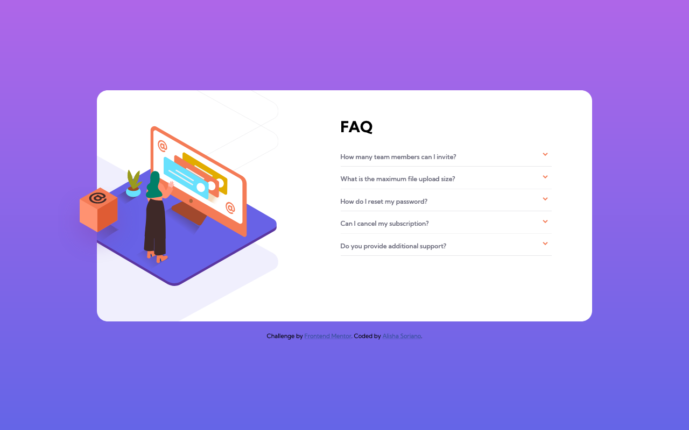

# FAQ Accordion Card Solution
FAQ Accordion Card challenge from frontendmentor.io, implemented by Alisha S.

This is a solution to the [FAQ accordion card challenge on Frontend Mentor](https://www.frontendmentor.io/challenges/faq-accordion-card-XlyjD0Oam). Frontend Mentor challenges help you improve your coding skills by building realistic projects.

## Table of contents

- [Overview](#overview)
  - [The challenge](#the-challenge)
  - [Screenshot](#screenshot)
  - [Links](#links)
- [My process](#my-process)
  - [Built with](#built-with)
  - [What I learned](#what-i-learned)
  - [Continued development](#continued-development)
  - [Useful resources](#useful-resources)
- [Author](#author)

## Overview
The FAQ Accordion Challenge tasked the developer to recreate the given accordion and illustration positioning by using HTML, CSS and JavaScript. A bonus was to do it using no JS at all. I chose to go this route.

### The challenge

Users should be able to:

- View the optimal layout for the component depending on their device's screen size
- See hover states for all interactive elements on the page
- Hide/Show the answer to a question when the question is clicked
- **Bonus**: Complete the challenge without using JavaScript

### Screenshot

### Links

- Solution URL: [GitHub](https://github.com/AlishaSo/faq-accordion-card)
- Live Site URL: [GitHub Pages](https://alishaso.github.io/faq-accordion-card/)

## My process
I took the following steps to complete this project:

  1. Set up the HTML file with the necessary <head> information, and the proper semantic <body> elements for the given page skeleton.
  2. Add general styles to the page, such as sizing, font, and background.
  3. Include mobile styles, pertaining to: placing the illustration image and shadow, and aligning the accordion as well as code its behavior.
  4. Handle desktop styles for both the images and background shadow, as well as the accordion.

### Built with

- Semantic HTML5 markup
- CSS custom properties
- Flexbox
- CSS Grid
- Mobile-first workflow

### What I learned

By doing this project, I learned:

- How to create an accordion with no JS
- That it's best to style via classes than IDs
- About the ability to have negative margins
- The pseudo element's creation and behavior
- How to rotate an element
- The transform property
- How to overlap an element
- About the flexibility of the background element, more specifically that the sizing and position can be manipulated by various ways, including via percetages
- Truly that SVGs are on a league of their own when it comes to manipulating them

### Continued development

As I continue to learn practice my HTML and CSS, I want to put more emphasis on flex display and learn more about using em/rem vs px.

### Useful resources

- [Make A Pure CSS Accordion Without JavaScript](https://supfort.com/pure-css-accordion-without-javascript#:target) - This helped me to create the accordion without needing to use JS.
- [Coder Coder on YT: Building an accordion with HTML, CSS & JS (Part 1)](https://www.youtube.com/watch?v=FboXxLxg8eo) - This video helped me a lot in positioning the illustration images and background shadow.
- [Stackoverflow: Making gradient background fill page with CSS](https://stackoverflow.com/questions/16841323/making-gradient-background-fill-page-with-css/16841457) - The title says it all, I consulted this page to make my page background take up the full length.
- [dcode on YT: How to create a CSS-Only Accordion (Mobile Friendly) - HTML & CSS Tutorial](https://www.youtube.com/watch?v=pzy_QStQaqA) - I consulted this video to figure out how to add the arrows to the accordion label and how to make it rotate.
- [Interneting Is Hard: Chapter 10 - Responsive Design](https://www.internetingishard.com/html-and-css/responsive-design/) - I consulted this page to refresh my knowledge on media queries and proper setup for mobile-first development.

## Author

- GitHub - [Alisha S.](https://github.com/AlishaSo/)
- Frontend Mentor - [@AlishaSo](https://www.frontendmentor.io/profile/AlishaSo)
- Twitter - [@yourusername](https://www.twitter.com/yourusername)
